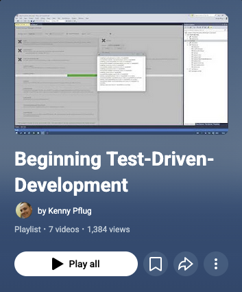

I've finished my newest video series called “Beginning TDD” and you can watch it [on YouTube now](https://www.youtube.com/playlist?list=PLIMrZfX3DMVEBHaiZIeZSNYCRsLILsuGm).

<!-- truncate -->

In it, I show you how to practically start with Test-Driven-Development in Visual Studio 2015 CTP and xunit.net 2. I discuss things like the Red-Green-Refactor-Commit cycle, Triangulation vs. Behavior Verification tests, the Builder pattern, and advise you how to generally structure your TDD workflow.

To understand the content, I would recommend that you know how to program in C# and know how to write an automated test that can be executed in the Visual Studio Test Runner.

Enjoy the videos! If you have questions or would like to provide feedback, please feel free to leave a comment here or in the comments of the videos.

