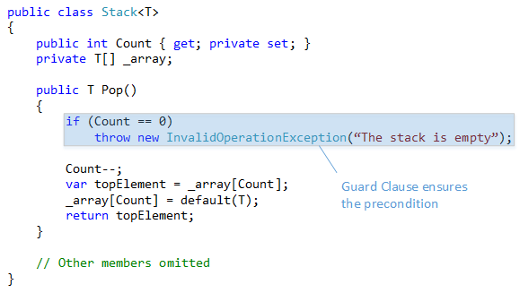
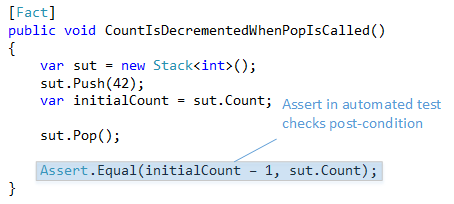

I'm currently reading Bertrand Meyer's "Object-Oriented Software Construction" (finally, I should say) and I'm absolutely amazed. Part of the reason I haven't touched this book yet is its age: the second edition was released in 1998. A book that is now 17 years old (the first edition being even ten years older) – what could I learn from it, especially in a field like software development where things change relatively fast?

<!-- truncate -->

Well, I was totally wrong. Not only are the topics Bertrand Meyer addresses in his book still relevant for OOP today, but more importantly he describes concepts that are not fully supported by popular object-oriented languages like C++, C#, or Java, although they are deemed necessary to achieve the main goals of software quality with OOP according to Meyer.
One of these concepts is Design by Contract. And the best thing is that you probably apply it in your daily programming already, although not to such an extend as Meyer intends you to. So let's check what Design by Contract actually means.

## TLDR;

Design by Contract is an important concept to model and implement object-oriented software, with pre- and post-condition checks being the essential element to define the semantically correct behavior of a routine / method. The Eiffel programming language has built-in support for it, but we can introduce these checks to other languages like C# by using Guard Clauses and automated tests.

## What is Design By Contract?

I asked some of my fellow software developers what they think Design by Contract is and none of them could tell me (to be honest, a few weeks back, I couldn't have either). Some of them guessed that it might have to do something with interfaces or abstract base classes, i.e. an abstraction defining a contract between a class that implements the abstraction and client code that wants to call functionality through the abstraction. Well, that's wrong, although Design by Contract has some interesting effects on object-oriented abstractions, but we'll discuss this in a later post.

But let's cut to the chase: Design by Contract is about semantical restrictions between a client (the caller) and a supplier (the called one). These restrictions reside on the supplier code and simply state: **"if you satisfy the preconditions when you call me, I will perform all operations necessary to satisfy the post-conditions"**. To make this concept more tangible, let's give some everyday programming examples:

- If you call the `SquareRoot` function with a positive real number (this is the precondition), then this function will return the square root of your argument (this is the post-condition).
- A call to `Stack.Pop` will return the top element of the stack (post-condition), if it is not empty (precondition).
- If you want to call the constructor of class `LotteryNumbersGenerator` successfully (post-condition), you have to specify a reference to an instance of `Random` that is not `null` (precondition).

As you can see, **Design by Contract is not about syntax** (e.g. that you provide values of the correct type, otherwise the compiler would not build your code), **but about semantics**, i.e. the meaning of values (you cannot take the square root of a negative real number) and the meaning of object state (a stack cannot return a valid element when it is empty). Meyer also provided a mathematical notation for that:

```
{ P } A { Q }
```

This correctness formula might seem somewhat difficult, but it simply states that if a client calls functionality `A` on the supplier and satisfies the precondition `P`, then the post-condition `Q` holds when `A` is implemented correctly according to the intended specification. Just the thing we described in our examples.

**Thus Design by Contract is a concept to prove the correctness of a piece of software** – and it is important to note that Meyer talks about "the relative notion" of correctness. "A software system or software element is neither correct nor incorrect per se; it is correct or incorrect with respect to a certain specification. Strictly speaking, we should not discuss whether software elements are correct, but whether they are consistent with their specifications." This means that e.g. a method only performs correctly according to the intended specification, whether that's captured in our mind, a user story, or a product requirement document.

## How do you apply Design by Contract?

Bertrand Meyer also created a programming language called Eiffel and the cool thing is that it directly supports specifying the preconditions and post-conditions that are so important for Design by Contract. In his book, he often uses stack examples, so let's look at a similar one to see how preconditions and post-conditions are specified in code:


In the figure above, you see an excerpt of a generic class called `STACK[T]` that uses an array internally. You also see the features (that’s how class members are called in Eiffel) `array`, `count`, `is_empty`, and `pop`. `is_empty` and `pop` are routines (methods), `array` and `count` are attributes (fields), and please note that although `count` is public (as indicated by `feature {ANY}`), it cannot be set by client code because attributes in Eiffel are read-only by default outside of the class scope.

The important parts are the `require` and `ensure` clauses: these Boolean expressions (Meyer calls them assertions) can be used to express the semantic pre- and post-conditions of a routine. Each of these expressions can be preceded by a label (like `stack_is_not_empty`) that shortly describes the error and you can list as many of these assertions in a `require` or `ensure` section as you like. The result should be clear: before the actual routine body (the `do` section) is executed, all assertions in the `require` section are executed to check if the caller satisfies the preconditions (in this case, the stack must not be empty). After the body is executed, all assertions in the `ensure` section are checked to guarantee that the `do` section is implemented correctly.

These checks are actually performed by the Eiffel runtime when the application is executed. If any of them fails then an exception will be raised that can be handled or that will crash the application. You might be thinking that this could be a large performance overhead, but you can selectively disable these runtime assertions when you build your code. In practice, you would enable these assertions when you develop your code, but disable at least the post-condition checks when you deploy your software to the customer.

## Pre- and Post-Conditions in C#

Back to Visual Studio and C#: I hope you saw that Design by Contract is a cool feature because it gives semantical meaning to a routine that can be used for documentation purposes and verified by runtime checks. In C#, we do not have a similar feature, but we can easily check pre- and post-conditions. You want to know how?

Well, how do you check if a parameter value is correct or if an object is in a correct state when a method is called? I use Guard Clauses for this: before the actual logic in a method is executed, `if` blocks are used to identify erroneous conditions. If at least one of them is found, an exception describing the error is thrown, and this mimics exactly what happens at runtime in an Eiffel application when a caller didn’t satisfy a precondition – this indicates a bug in the client code. Here's an example of how a Guard Clause might look in C#:



Consequently, I argue that Guard Clauses shall be used most of the time to model precondition checks on methods. But this is the easier one of the two parts. The other one remains: how do we perform post-condition checks?

Of course, one could imagine adding something similar like Guard Clauses at the end of a method body: `if` blocks that check whether the returned value is valid or whether the object state was changed correctly, throwing an exception otherwise. But this is not the solution that I advise you to pursue.

Instead, there is a mechanism that you probably use already and that performs post-condition checks: automated testing. If you write and execute triangulation tests, you check that the public API of the system under test behaves correctly. Let’s have a look at a unit test checking that count is reduced by one when Pop is called.



In the figure above, you see that the system under test (SUT) is instantiated and brought into a relevant state in the Arrange Phase so that `Pop` can be executed in the Act phase without violating the precondition. Finally a check to the SUT's state is made in the Assert Phase of the test. Again, the behavior here is exactly the same as the one of the Eiffel runtime: if a post-condition is not satisfied, an exception is thrown causing a crash. In this case, the test fails instead of crashing the application, but the conclusion is the same: something is wrong with your supplier code – there is a bug in `Stack<T>`. And you use these tests while you develop your software, but you won't ship them when deploying your solution to the customer.

## Where to go from here?

There is a lot more to Design by Contract like class and loop invariants, but the fundamental part is the use of pre- and post-conditions. We’ve seen that we can introduce these into our C# projects by using Guard Clauses and automated testing (and of course this applies to other languages like C++ or Java, too). I think we can learn a lot from Design by Contract – we should really investigate if this concept could help us produce better code for Guard Clauses and especially automated tests.

There are numerous frameworks out there introducing Design by Contract to C# in other ways than proposed in this post. The most popular one is probably [CodeContracts](https://www.microsoft.com/en-us/research/project/code-contracts/) which essentially performs MSIL binary rewriting and is even able to perform some compile-time checks. But why introduce these complex mechanisms when we can achieve the same goals with simpler, more transparent approaches?
