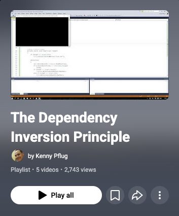

During the past weeks, I have been releasing videos on the [Dependency Inversion Principle](http://www.objectmentor.com/resources/articles/dip.pdf) (DIP) which was originally published by [Uncle Bob](http://blog.8thlight.com/uncle-bob/archive.html) in 1996. I'm happy to announce that my video series is finished – [you can watch it on YouTube now](https://www.youtube.com/playlist?list=PLIMrZfX3DMVFM_8EgFXmfVhOUNfMvXLLt).

<!-- truncate -->

In this video series, we start off with the first example of Uncle Bob's paper which is (more or less) the simplest text editor possible, implemented in a procedural style of programming. Through applying the DIP, we simplify our code and realize the need for objects. We also discuss what role Dependency Injection (DI) plays in the grand scheme, what a composition root is, and how you can use a DI container to resolve object graphs dynamically. We finish the series with a look at the Composite Pattern and the consequences of the DIP on software architecture.

I hope you will enjoy the videos. If you have any questions or recommendations, please feel free to post them in the comments section on YouTube.

