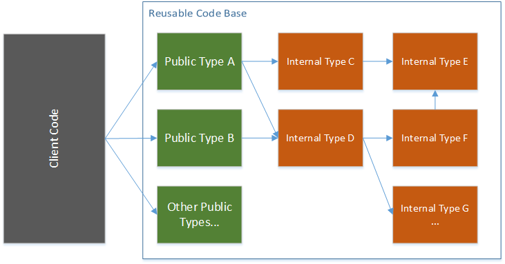

In [one of his recent posts](https://blog.ploeh.dk/2015/09/21/public-types-hidden-in-plain-sight/), Mark Seemann argued that you should not use the `internal` modifier for types and their members, because this decreases the testability of your code. While I totally agree with him on the subject, I want to highlight another reason for not using `internal`: the extensibility of your reusable code bases.

<!-- truncate -->

## TLDR;

Developers of reusable object-oriented code bases (specifically library/framework developers) often use the `internal` modifier to hide intrinsic details from client code. But as these abstractions are most certainly leaky, this usage actually harms the user-friendliness of the code base, because the user cannot easily extend or replace the internal types. Therefore, avoid `internal` in such code bases and use `public` instead, unless you have a very good reason to break this recommendation.

## Internal makes your API less user-friendly

As stated in [Mark Seemann’s post](https://blog.ploeh.dk/2015/09/21/public-types-hidden-in-plain-sight/), the main argument of programmers using `internal` as a modifier is to ensure Encapsulation, i.e. the programmer should only see the public API that he or she should program against. While this use of the term Encapsulation is not correct in my opinion, it usually results in a scenario where (more or less) all types that do the heavy lifting (after a public method was called) are `internal`. This allows the designer of the reusable code base to change these types while ensuring backward compatibility by simply giving the user no access to the internal types. Schematically, the following diagram depicts this situation:

However, reusable code bases, i.e. libraries, frameworks, and shared projects are abstractions and [complex abstractions will become leaky sooner or later](http://www.joelonsoftware.com/articles/LeakyAbstractions.html), as discussed in my last post. If you really want your code to be reused by other people, at one point in time some of them want to look under the covers of your code, probably to extend your functionality or speed up something.

What if the extension point is an `internal` type? That is just plainly annoying for the user who wants to change how your code works. While internal members of internal classes can be called using reflection, one simply cannot derive from an internal class or implement an internal interface. The only option is to download the source code (if available, but fortunately there is a trend to Open Source software), then modify the relevant parts, compile and redeploy – it’s just frustrating, a waste of lots of hours and another violation of the Open/Closed Principle.

## Use public instead

If you want to write reusable code (and isn’t this one of the main reasons for the existence of software developers?), then you will most likely have several problem areas that you have to solve within your library/framework. Decouple those different areas with polymorphic calls and make sure that the interfaces or abstract base classes are `public`. Write your classes in a way so that they conform to Bertrand Meyer’s Design by Contract, i.e. they protect their invariants, pre- and post-conditions and fail fast when the client specifies invalid arguments. Then there is no reason to not make these classes `public`.

Most important, give the user the ability to modify the object graph that your library/framework creates. This way he or she can add new implementations, decorate existing objects and so on. The [builder pattern has proven useful](http://blog.ploeh.dk/2014/05/19/di-friendly-library/) in this scenario.

And if you don’t want to reveal all types to the user at once, then “hide them in plain sight” as suggested in [Mark’s article](https://blog.ploeh.dk/2015/09/21/public-types-hidden-in-plain-sight/). Use different namespaces, and the most obious one should contain the most important types for high level access of your framework/libary. Also, provide documentation on how your code is structured internally (e.g. static and dynamic UML diagrams) so that the user can get an overview and navigate your types quickly.

And don’t be afraid about backward compatibility: use an append-only model for types that reside in the master branch, i.e. replace them with new types and mark them obsolete instead of changing them (again OCP). And use [sematic versioning](http://semver.org/) to easily indicate if you introduced breaking changes or not.

In the end, your code will be more [leak proof](http://www.joelonsoftware.com/articles/LordPalmerston.html).

## When to use internal

One question remains: when is the use of internal actually beneficial? Personally, I would only consider using this modifier if a class is badly encapsulated, i.e. it does not protect its invariants, pre- and post-conditions and must be used in a special way that’s not really obvious to the user. But then again, why was this class written this way in the first place?

Anyway, if one encounters such a class, it is ok in my opinion to mark it internal. But please do not mark important interfaces or abstract base classes as internal, because in OOP, this is the main point of extensibility – providing new objects that are called polymorphically. Also, the InternalsVisibleToAttribute is not a solution, because as the author of the reusable code base, you cannot know all the clients that will use your API upfront.

In any other case, I cannot think of a sensible situation where internal should be used – but if you know one, please let me know.
