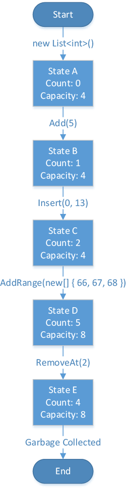

[In one of my last posts](/blog/2015-07-04-about-guard-clauses-automated-tests-and-design-by-contract), I discussed the basics of Bertrand Meyer's Design by Contract, namely pre- and post-conditions on methods. These Boolean assertions are used to check if the caller supplied valid arguments and performed the call while the target object was in a valid state, as well as to verify that the method produced the correct return value and/or side effects after it executed completely. This allows us to give semantic meaning to methods on our objects.

In this post, we will go one step further and discuss what class invariants are.

<!-- truncate -->

## TLDR;

Aside from pre- and post-conditions, class invariants form another important part of Design by Contract. While the former are usually specific to single methods, invariants capture the very essence of a class by defining conditions that must hold true before and after every method call. Constructors have a special purpose in Design by Contract: their task is to initialize objects in such a way that all invariants are satisfied.

## List&lt;T&gt; as an introductory example

Let's start off with a small example: I'm sure you know what collections are, so in the upcoming paragraphs we'll have a look at the pre- and post-conditions of some of the most prominent methods of `List<T>` which uses an array internally to organize its items. We'll begin with the `Add` method which is defined like this:

```csharp
public void Add(T item);
```

This method does not require any preconditions (the list must not be in a special state and one can pass in any value for the item argument), but it has the following post-conditions:

- The Count property will be incremented because of the added item:<br />`(this.Count == old this.Count + 1)`
- Count will never be less than one:<br />`(this.Count > 0)`
- Count will be less or equal to the Capacity of the internal array:<br />`(this.Count <= this.Capacity)`
- The item being passed in can be retrieved at the end of the collection:<br />`(this[this.Count - 1] == item)`

As you can see, I provided the conditions in prose text as well as Boolean expressions in C# where `this` represents the `List<T>` instance. In fact, I mixed in one notion of the Eiffel Design by Contract notation: the `old` keyword. In this case, `old this.Count` just states that the property returns the value it had before `Add` started to execute, i.e. at the beginning of the method. Also, please note that all these expressions are assertions, i.e. ultimately they read values from fields or parameters and compare them with something else to return a Boolean value, but they do not have side effects like changing the value of a field (which is why I didn't write `this.Count++`).

Pretty easy to understand, I guess. So let's move right on to the next method:

```csharp
public void Insert(int index, T item);
```

Like `Add`, this method has no restriction on the item argument, but it has preconditions for index that the caller has to fulfill:

- index must not be less than zero<br/>`(index >= 0)`
- index must not be greater than Count<br/>`(index <= Count)`

Additionally, there are the following post-conditions:


- Count will be incremented because of the inserted item<br/>`(this.Count == old this.Count + 1)`
- Count will never be less than one<br/>`(this.Count > 0)`
- Count will be less or equal to the Capacity of the internal array<br/>`(this.Count <= this.Capacity)`
- The item being passed in can be retrieved at the inserted index<br/>`(this[index] == item)`
- All items that were in the collection at position index or after will be moved by one position<br/>`(this[n] == (old this)[n – 1] for every n ϵ [index + 1, this.Count])`

I'm sure you noticed that the first three post-conditions are exactly the same as the ones of the `Add` method. And for the fifth post-condition, I resorted to a more mathematical notation (because otherwise I would have to write a for loop to indicate that all subsequent elements were moved by one position).

Finally, let's have a look at the pre- and post-conditions of the `RemoveAt` method:


```csharp
public void RemoveAt(int index)
```

Again, there are preconditions for index:

- index must not be less than zero<br/>`(index >= 0)`
- index must not be greater than Count<br/>`(index <= Count)`

And the post-conditions for `RemoveAt` are:


- Count will be decremented because of the removed item<br/>`(this.Count == old this.Count – 1)`
- Count will be greater or equal to zero<br/>`(this.Count >= 0)`
- Count will be less than the Capacity of the internal array<br/>`(this.Count < this.Capacity)`
- The item at the specified index is removed<br/>`(this.Contains((old this)[index]) == false)`
- All items that were in the collection after the removed item will be moved forward by one position<br/>`(this[n] == (old this)[n + 1] for every n ϵ [index, this.Count])`

With all these conditions in mind, let's check out what class invariants actually are.

## What are class invariants?

I'm sure you have noticed the similarities between the conditions on these three methods. Now I want to present to you three more conditions:

- Count must not be less than zero<br/>`(this.Count >= 0)`
- Count must not be greater than Capacity<br/>`(this.Count <= this.Capacity)`
- Capacity is the same value as the Length of the internal array<br/>`(this.Capacity == this.internalArray.Length)`

You undoubtedly have guessed it: these are the invariants of the `List<T>` class. The special thing about these three conditions is that they must hold true at any "stable" moment in the lifetime of the collection object – not just at the beginning or end of a single method. And please notice that these conditions do not target specific arguments or return values. As they relate to the class as a whole, you can of course only target fields (or their corresponding properties) to form the Boolean expressions.

How did I come up with these? I derived them by looking at all the conditions listed above and forming new conditions that 1) target only fields and 2) are also satisfied when any set of pre- or post-conditions is checked.

But what is exactly meant with "stable" moments in the object's lifetime? To illustrate this, let's have a look at the following lifetime flowchart of a single collection object (Bertrand Meyer used a similar, more general one in his book "Object-Oriented Software Construction" on page 365):



As you can see, the lifetime of this collection object is not that thrilling. After it is initialized by calling the constructor, the collection is empty with an initial array capacity of four. After the subsequent calls to `Add` and `Insert`, the `Count` property rises, until the `AddRange` call requires the internal array to be exchanged with a new one having double the size. Finally, one item is removed with the `RemoveAt` call and afterwards the collection is garbage collected because there is no more reference pointing to it.

All of the object states that you see in the picture fulfill the invariants defined above. Please note that during execution of the different methods of the collection, the invariants may be violated (e.g. the `Count` property was incremented before the internal array was exchanged on a call to `Add`) – the only thing that matters is that all the invariants are satisfied before a method starts executing and when a method returns control to the caller, and that is the meaning of “stable” points in time. This is especially important in multithreading scenarios where a certain access constellation of different threads to the same object might lead to an invalid object state, violating the class's invariants.

In the end, the introduction of class invariants lets us update the mathematical notation for Design by Contract that was introduced in the last post as follows:

```
{ INV and P } A { INV and Q }
```

This just states that additionally to the preconditions that must hold true to execute method `A`, the invariants must all be satisfied, too. The same goes for the post-conditions: besides the ones that are method-specific, the body of the method must also make sure not to violate any invariants. The only exception where this Hoare Triple must not be fully satisfied is during the execution of the constructor of a class, since the object is not yet fully initialized and the invariants may not hold until the constructor completes.

## What constructors are really about

As we all know, a constructor is the first function being called to bring an object into existence. Consequently, the class invariant cannot be satisfied at the beginning of the constructor call (because the object does not exist yet), which leads us to the following modification of the Hoare Triple above:

```
{ P } C { INV and Q }
```

This reduced formula states that the constructor `C` can have specific pre- and post-conditions, but does not need to satisfy the class invariant at the beginning of execution. However, in this formula lies another important aspect: a constructor must initialize an object in such a way that the invariants of that very class are all satisfied.

This fact is so important that I say it once again because every now and then I can find violations of this rule in code I review:

> Make sure that all the constructors of a class initialize an object in such a way that the class's invariants are satisfied – there must be no constructor that leaves an object in an invalid state after it has executed.

And this is what constructors are really about.

## How to find class invariants

There are mainly two ways to find the invariants of a class: the possibly simpler one is to have a look at all the pre- and post-conditions of the methods of your class (including properties) and check if general conditions can be extrapolated from them using Boolean logic. As I said above, this is what I actually did with the listed pre- and post-conditions of `List<T>`, e.g. the conditions on the `Count` property above can be easily derived from the pre- and post-conditions of the methods we looked at in the first section (you actually have to look at all the member functions of `List<T>` – but I guess you are familiar with collections and can easily anticipate that the conditions above are satisfied by every member).

The other way is to have specifications for certain classes already in place: e.g. when you write a chat application where every user has an account, and there is a rule stating that an account must at least have a nick name, then bring in this business rule as an invariant for the Account class. This will probably lead to a constructor where you can pass in a string for the nick name, and the constructor checks if the string is not null and sets the corresponding field, so that the invariant is protected. This is the main reason for using Design by Contract: giving programming structures semantic meaning.

If you want to learn even more about Design by Contract, please check out Bertrand Meyer’s awesome book [Object-Oriented Software Construction](https://archive.eiffel.com/doc/oosc/).
