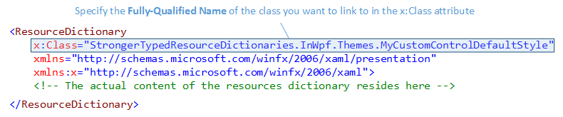
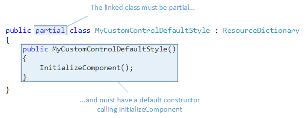
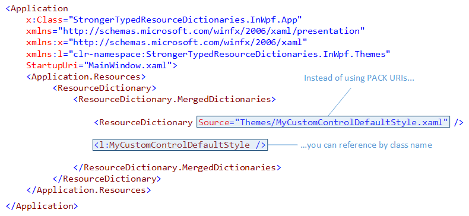
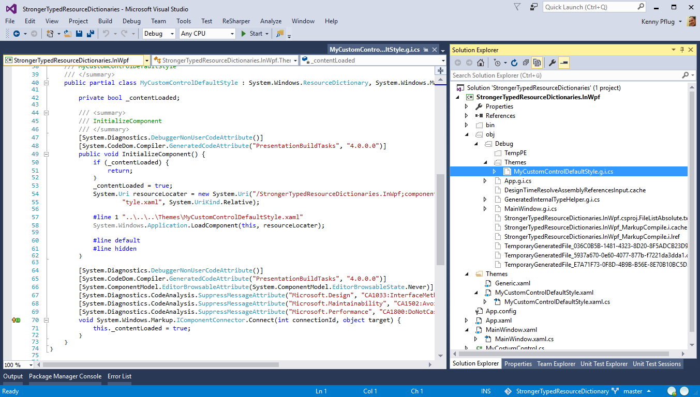

If you’ve ever programmed in XAML-based technologies, you know Resource Dictionaries: these XAML files usually contain the styles and templates you want to share across different views, or provide the default styles for Custom Controls you’ve written.

If you want to merge Resource Dictionaries into others (like e.g. within your App.xaml file), you normally use so-called [PACK URIs](https://learn.microsoft.com/en-us/previous-versions/dotnet/netframework-4.0/aa970069(v=vs.100)) to reference them. However, there is another way: you can combine your XAML file with a code-behind file to create a subclass of ResourceDictionary and reference it via its class name. This is what I call **Stronger-Typed Resource Dictionaries**.

<!-- truncate -->

## TLDR;

Resource Dictionaries can be equipped with the `x:Class` attribute to link them to code-behind files containing C# code. This way you can e.g. attach event handlers to XAML elements within your styles and templates, and for some technologies like `x:Bind`, this approach is absolutely mandatory. As you cannot reference these linked Resource Dictionary with the PACK URI syntax any longer, but instead have to use the actual sub-class name, I refer to them as Stronger-Typed Resource Dictionaries.

## How to combine Resource Dictionaries with C# classes?

If you want to combine a Resource Dictionary with a code-behind file, you’ll use an element you probably already know from XAML User Controls: the `x:Class` attribute. This attribute has to be set on the `ResourceDictionary` element itself, like in the following image:

Within the `x:Class` attribute, you specify the Fully-Qualified Name of the class that you want to link to. This is usually the class that you created in the code-behind file (*.xaml.cs), but it does not necessarily have to be there (it can reside within any file of the same assembly).

The linked class itself must be a `partial` class and must have a default constructor – within the latter, you must call the `InitializeComponent` method, as you can see in the following image:

And this is it, you’re done. You successfully linked the XAML and C# files and can now merge your Resource Dictionary in other ones by using the class name instead of the Source attribute to specify the URI to the XAML file, as shown in the following picture (in fact, you must use the class name, the old method with Source does not work any longer):

## What happens behind the scenes?

You might be wondering how the XAML and C# files are actually connected. This is done via another file with a ".g.i.cs" extension that is automatically generated by the compiler. By default, you cannot see this file, but look at the top of the solution explorer in Visual Studio and you’ll find a button called “Show All Files” – if you click it, you’ll see all the content of your solution folder, not only the items that are part of the solution file.

When you’ve done that, take a look at the “obj/Debug/” folder of your project: within it (or one of its sub-folders), you can find a file with the same class name and the .g.i.cs extension. As you can see in the image above, the namespace and class names are derived from the Fully Qualified Name you provided to the x:Class attribute. And within the generated code, you can also identify the InitializeComponent method that you call from the constructor of your code-behind file. The content of this method is technology-specific, but in WPF, it loads the XAML file contents as a component. This acts as the glue between XAML and C#.

## Use Stronger-Typed Resource Dictionaries…

Finally, we should shortly discuss some scenarios where these Stronger-Typed Resource Dictionaries provide benefit.

### ...with x:Bind

Under Windows 10, the Universal Windows Platform (UWP) provides a new mechanism for Data Binding called [x:Bind](https://learn.microsoft.com/en-us/windows/apps/develop/platform/xaml/x-bind-markup-extension). In MVVM scenarios, you might want to create a Data Template that visualizes View Models for an Items Control. When you want to bind your Data Template elements to View Model properties using `x:Bind`, and this data template resides in a Resource Dictionary, then you absolutely have to use Stronger-Typed Resource Dictionaries because bindings with `x:Bind` are no longer resolved at runtime using reflection, but the compiler actually generates code that updates source and target in the .g.i.cs file. And I really encourage you to use `x:Bind` where possible because it is blazingly fast in comparison to the "old" reflection-based bindings.

### …within Generic.xaml

When creating Custom Controls, you usually have to provide a default style for each of them. These default styles must reside in a special Resource Dictionary called Generic.xaml (or a theme-specific one). If you have a library with several custom controls, then Generic.xaml can become quite large because default styles are usually not the smallest XAML elements (especially if you incorporate a Control Template with Visual States). So it would be good to move these styles to Resource Dictionaries of their own and merging them all into Generic.xaml.

In this case you have to use the full PACK URI syntax including the assembly name to reference these dictionaries because it is technically possible that your default style must be found while the corresponding assembly is not fully loaded. However, you can use Stronger-Typed Resource Dictionaries in this case to avoid the annoyingly long PACK URI syntax.

### …when you want Event Handlers within your Styles and Templates

As Styles and Templates normally reside in Resource Dictionaries, you have no means of attaching Event Handlers to the corresponding XAML elements. But if you use Stronger-Typed Resource Dictionaries, you can just do that – it’s the same thing as if you write Event Handlers for a User Control.

To be honest, I wouldn’t use this very often because I usually adhere to the MVVM pattern, but you might find this useful in certain scenarios.