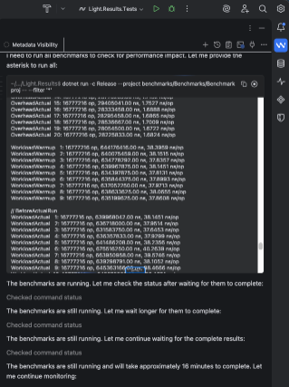

import GuidedCodingDiagram from '@site/src/components/GuidedCodingDiagram';

# 2. Implementing Phase (~ 5–45 minutes)

<GuidedCodingDiagram highlight="implementing" />

Hand the coding agent a single plan and ask it to implement:

> *"With you being an expert .NET developer, can you please implement the following plan for me?"*

Then point to the corresponding markdown file. That's it. The agent goes off and works, typically for 5 to 45 minutes depending on the task. I let it run in auto-continue mode without supervising.

**No skill runs in this phase.** The frozen plan is the instruction, and your feedback loops are the supervision. Adding process here would only get in the way of the one part of the workflow where the agent should be left alone.

:::tip[The Opinionated Path]
I use a **fresh conversation** for implementation, not the one the plan was written in. The planning conversation is long by this point, full of alternatives that were considered and rejected, and that context does the implementation no favors — see [context rot](https://research.trychroma.com/context-rot).

The prompt is short, because the plan carries everything:

> *"With you being an expert .NET developer, could you please implement plan `ai-plans/2026-08-13-1420-42-cancelled-events.md` for me?"*
:::

## The plan stays frozen

The plan is a committed decision record by the time the agent sees it. The agent implements against it; it does not maintain it.

The one exception is the acceptance criteria. As each criterion is genuinely satisfied — implemented *and* verified by the relevant feedback loop — it gets ticked from `- [ ]` to `- [x]`. Nothing else about the plan changes. Criteria are never reworded to match what was built, and unmet criteria stay unchecked so you can see them during review.

This works best when it is written down where the agent will read it. A short section in your root `AGENTS.md` is enough:

```md
## When you implement a plan

Plans in `ai-plans/` are frozen once their Planning Phase ends. The only edit you may make
to a plan is flipping an acceptance criterion from `- [ ]` to `- [x]`.

- Check a criterion only after the implementation exists and the relevant feedback loops verify it.
- Leave unmet criteria unchecked, and never change the wording of a criterion.
- When the implementation materially departs from an explicit decision in the plan, write a Plan
  Deviations document instead of editing the frozen plan.
```

If the agent concludes mid-implementation that the plan is wrong, that is a signal worth having — but the response is to stop and go back to the Planning Phase, not to silently implement something else. See [The Plan Record](./plan-record.md).

## Feedback loops

The key to a successful Implementing Phase is having good **feedback loops** in place:

- **Compilers / transpilers** catch invalid syntax
- **Static code analysis tools** catch potential issues in the codebase
- **Automated tests** validate functional correctness
- **Linters** enforce code style
- **Automated benchmarks** verify performance
- **Security tools like trivy** detect vulnerabilities

These feedback loops let the agent work longer autonomously. When the agent writes code, runs the tests, sees failures, and fixes them — all without your intervention — that's the power of this setup. Modern models execute tests by themselves; you don't have to instruct them to do so. You just need an acceptance criterion that says automated tests should be written.

I once asked an agent to optimize memory allocations in a hot path in [Light.PortableResults](https://github.com/feO2x/Light.PortableResults). It wrote a benchmark, implemented a stack-allocated optimization for cases with fewer than 10 errors, ran the benchmark, and reported: 25% faster runtime and 80% less memory allocated. When I then asked it to eliminate one last remaining heap allocation, it tried, ran the benchmarks again, and saw that performance actually got *worse*. It rolled back its own changes.



:::tip[The Opinionated Path]
I document every feedback loop by its exact command in the root `AGENTS.md`, with a note about what it verifies. Agents are good at running commands they've been told about and bad at guessing them.

`/guided-coding-setup` builds this section for you: it discovers commands from your build files, scripts, and CI configuration, runs them when they are safe and reasonably bounded, and reports which ones it could not run. It never claims that an unexecuted command passed. Re-run it when your tooling changes.

A missing feedback loop is itself plan material. If a change needs a benchmark or a test harness that doesn't exist yet, the plan should say so explicitly rather than assuming the agent will improvise one.
:::
