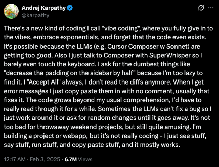

# Guided Coding: Staying in Control While Coding with AI Agents

## TL;DR

Guided Coding is a three-phase methodology — **Plan**, **Implement**, **Guide** — for writing enterprise-grade software with AI coding agents while maintaining full ownership of your codebase. It is a **counterpart to Vibe Coding** with a heavy focus on planning and reviewing iteratively in collaboration with the coding agent.

<svg viewBox="0 0 870 200" xmlns="http://www.w3.org/2000/svg" style={{maxWidth: '870px', width: '100%', margin: '1.5rem auto', display: 'block'}}>
  {/* Background */}
  <rect x="0" y="0" width="870" height="200" rx="8" fill="#D6D6D6" />

  {/* Phase boxes */}
  <rect x="30" y="135" width="200" height="50" fill="#0078D4" rx="4" />
  <text x="130" y="166" textAnchor="middle" fill="white" fontFamily="Segoe UI, sans-serif" fontSize="15" fontWeight="600">1. Planning Phase</text>

  <rect x="275" y="135" width="200" height="50" fill="#E88A00" rx="4" />
  <text x="375" y="166" textAnchor="middle" fill="white" fontFamily="Segoe UI, sans-serif" fontSize="15" fontWeight="600">2. Implementation Phase</text>

  <rect x="520" y="135" width="200" height="50" fill="#6B2FA0" rx="4" />
  <text x="620" y="166" textAnchor="middle" fill="white" fontFamily="Segoe UI, sans-serif" fontSize="15" fontWeight="600">3. Guiding Phase</text>

  {/* Done / PR box */}
  <rect x="765" y="140" width="80" height="40" fill="#107C10" rx="20" />
  <text x="805" y="166" textAnchor="middle" fill="white" fontFamily="Segoe UI, sans-serif" fontSize="14" fontWeight="600">✓ PR</text>

  {/* Forward arrows between phases */}
  <line x1="230" y1="160" x2="270" y2="160" stroke="#888" strokeWidth="2.5" markerEnd="url(#arrowGray)" />
  <line x1="475" y1="160" x2="515" y2="160" stroke="#888" strokeWidth="2.5" markerEnd="url(#arrowGray)" />
  <line x1="720" y1="160" x2="760" y2="160" stroke="#888" strokeWidth="2.5" markerEnd="url(#arrowGray)" />

  {/* Arrow marker definitions */}
  <defs>
    <marker id="arrowGray" markerWidth="10" markerHeight="7" refX="9" refY="3.5" orient="auto">
      <polygon points="0 0, 10 3.5, 0 7" fill="#888" />
    </marker>
  </defs>

  {/* Self-loop on Planning Phase (right side) */}
  <path d="M 205 135 V 115 Q 205 105, 195 105 H 175 Q 165 105, 165 115 V 122" fill="none" stroke="#0078D4" strokeWidth="7" />
  <polygon points="165,132 155,114 175,114" fill="#0078D4" />

  {/* Blue arrow: Guiding → Planning (large issue) */}
  <path d="M 660 135 V 50 Q 660 25, 635 25 H 155 Q 130 25, 130 50 V 100" fill="none" stroke="#0078D4" strokeWidth="11" />
  <polygon points="130,130 108,96 152,96" fill="#0078D4" />

  {/* Yellow arrow: Guiding → Implementation (small issue) */}
  <path d="M 595 135 V 100 Q 595 80, 575 80 H 395 Q 375 80, 375 100 V 108" fill="none" stroke="#E88A00" strokeWidth="10" />
  <polygon points="375,130 355,100 395,100" fill="#E88A00" />
</svg>

- **Plan** iteratively with the agent, commit plans to git. Most important question at the end of the planning phase: "Would you add, change, or remove anything?" Ask this repeatedly until the plan stabilizes.
- **Implement** by handing off focused plans to the coding agent, backed by automated feedback loops like linting, automated testing, automated benchmarks, etc.
- **Guide** by thoroughly reviewing all generated code — this is where you spend most of your time. Understand the code, identify issues, and ensure quality. For small issues, prompt the agent to go back to the implementation phase. For larger changes, create one or more new plans together with the agent.

Keep rules files small, find the right plan size empirically for the LLMs you use, and stay vigilant about important software traits like functional correctness, performance, and security.

## Why Not Vibe Coding?

Andrej Karpathy, co-founder of OpenAI, [coined the term Vibe Coding in February 2025](https://x.com/karpathy/status/1886192184808149383). The core idea: you tell the coding agent what to do, never go down to the source code level, always click "accept all changes", and the code grows beyond usual comprehension. You only validate by looking at the running app — never at the code itself.

While Vibe Coding is fun for personal projects and useful for rapid prototyping, it is not a viable approach for enterprise-grade software. You have no idea what the code is doing or how it's doing it, and technical debt accumulates quickly. I wanted to formalize a counterpart — a methodology and mental model for working with coding agents that lets you leverage the productivity gains while staying in control of the codebase.

That's what Guided Coding is about.
