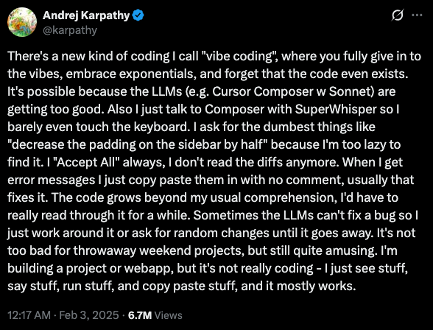

import GuidedCodingDiagram from '@site/src/components/GuidedCodingDiagram';

# Guided Coding: Staying in Control While Coding with AI Agents

## TL;DR

Guided Coding is a three-phase methodology — **Plan**, **Implement**, **Guide** — for writing enterprise-grade software with AI coding agents while maintaining full ownership of your codebase. It is a **counterpart to Vibe Coding** with a heavy focus on planning and reviewing iteratively in collaboration with the coding agent.

<GuidedCodingDiagram />

- **Plan** iteratively with the agent and commit the plan to git. Most important question at the end of this phase: "Would you change anything about the plan?" Ask this repeatedly until the plan stabilizes. When the phase ends, the plan is **frozen** — from then on it is a record of what you decided, not a document you keep editing.
- **Implement** by handing off a single focused plan to the coding agent in a fresh conversation, backed by automated feedback loops like linting, automated testing, automated benchmarks, etc.
- **Guide** by thoroughly reviewing all generated code — this is where you spend most of your time. **Understand the code**, identify issues, and ensure quality. For small issues, prompt the agent to go back to the Implementing Phase. For larger changes, write a follow-up plan together with the agent. When the finished code materially departs from the initial plan, record the differences in a **Plan Deviations** document.

You never stop guiding — it just changes shape along the way. In Planning, you and the agent map out the route together. In Implementing, you step away and let the plan and your feedback loops keep the agent on track. In Guiding, you take the wheel yourself.

Keep rules files small, find the right plan size empirically for the LLMs you use, and stay vigilant about important software traits like functional correctness, performance, and security.

## A Methodology, Not a Framework

Guided Coding is a way of working, not a toolchain you install. You can adopt all of it with nothing but markdown files, git, and the coding agent you already use. There is no CLI to learn, no artifact format you must conform to, and no vendor to lock yourself into.

That said, I do have a concrete setup that I use every day: a specific plan structure, specific filenames, a specific point at which a plan gets committed, and a set of [Agent Skills](https://github.com/feO2x/guided-coding) that automate the mechanical parts. It works well for me, and publishing it saves you from rediscovering the same details. But it is one instantiation of the methodology, not the methodology itself.

So these docs are written in two layers:

- **The method** — the regular text on every page. This is Guided Coding proper: the reasoning, the constraints, and the things that matter regardless of your language, your tracker, or your agent. If you only read this layer, you have understood Guided Coding.
- **The Opinionated Path** — set apart in callouts like the one below. **This is how I work**: exact prompts, exact filenames, and which skill I invoke when. Copy it wholesale, adapt it, or ignore it entirely.

:::tip[The Opinionated Path]
Callouts like this one show my concrete setup. This is the layer the [Guided Coding skills](https://github.com/feO2x/guided-coding) encode, and the [Quick Start](./quick-start.mdx) walks through it end to end.

Everything in these callouts is optional. Nothing here is required to practice Guided Coding.
:::

Please don't read "I installed the skills" as "I adopted Guided Coding". The skills automate bookkeeping — creating an issue, naming a file, committing it at the right moment. They cannot do the two things the methodology is actually about: thinking hard about the plan, and reviewing every line of code that comes back. Those remain yours.

## What Changed in Version 2.0.0

Version 2.0.0 sharpens one idea that was only implicit before: `ai-plans/` is an **append-only decision record**. Plans are not living documents that get edited to match reality. They record what you decided, when you decided it, and — through follow-up plans and Plan Deviations documents — how that decision later changed and why.

- Plans and Plan Deviations documents are **frozen** once committed. The only permitted edit to a frozen plan is ticking an acceptance criterion once the implementation actually satisfies it.
- Corrections are made by **appending**: a follow-up plan supersedes an earlier decision, a Plan Deviations document records where the finished code diverged.
- Filenames carry a **UTC timestamp**, so the directory reads in chronological order regardless of issue numbering.
- The method is distributed as portable **Agent Skills** and an **Agent Plugin** at [github.com/feO2x/guided-coding](https://github.com/feO2x/guided-coding).

The [Plan Record](./plan-record.md) page covers all of this in depth.

## Why Not Vibe Coding?

Andrej Karpathy, co-founder of OpenAI, [coined the term Vibe Coding in February 2025](https://x.com/karpathy/status/1886192184808149383). The core idea: you tell the coding agent what to do, never go down to the source code level, always click "accept all changes", and the code grows beyond usual comprehension. You only validate by looking at the running app — never at the code itself.

While Vibe Coding is fun for personal projects and useful for rapid prototyping, it is not a viable approach for enterprise-grade software. You have no idea what the code is doing or how it's doing it, and technical debt accumulates quickly. I wanted to formalize a counterpart — a methodology and mental model for working with coding agents that lets you leverage the productivity gains while staying in control of the codebase.

That's what Guided Coding is about.

## Where to Go Next

- Want to try the tooling right away? Start with the [Quick Start](./quick-start.mdx).
- Want to understand the method? Read the [Planning](./planning-phase.mdx), [Implementing](./implementing-phase.mdx), and [Guiding](./guiding-phase.mdx) phases in order.
- Want to know how the plans stack up over time? Read [The Plan Record](./plan-record.md).
